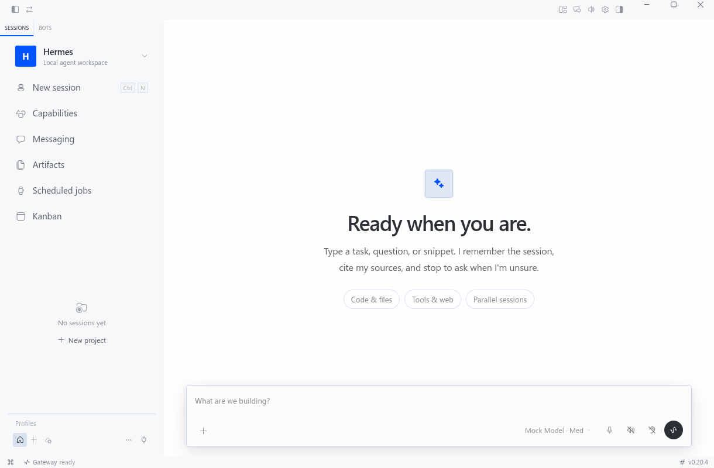

# Hermes Local

<p align="center">
  本地优先的 Hermes Agent 工作台：桌面端、WebUI、TUI、模型控制塔与运行追踪。
</p>

<p align="center">
  <a href="LICENSE"></a>
  
  
  <a href="UPSTREAM.md"></a>
</p>

> [!IMPORTANT]
> Hermes Local 是基于 [NousResearch/hermes-agent](https://github.com/NousResearch/hermes-agent) 的社区维护派生版，不是 Nous Research 官方发行版。上游源码、版权和 MIT 许可证均完整保留；本分支主要维护本地模型接入、模型中转配置、桌面体验和可观测性。

English summary: a community-maintained, local-first Hermes Agent distribution with a desktop workspace, relay profiles, model health checks, and run tracing.



## 这个分支解决什么问题

原版 Hermes 已经有成熟的 Agent 循环、工具调用、MCP、技能、记忆、子智能体、消息网关和定时任务。本项目不重写这些基础能力，而是在它们上面补一层适合个人电脑长期使用的控制面。

| 能力 | 这里做的事情 |
| --- | --- |
| 本地模型发现 | 探测 Ollama、LM Studio、vLLM、llama.cpp、LocalAI、SGLang，并兼容 WSL2 到 Windows 主机的访问路径 |
| 中转站配置 | 在界面中保存多个 Anthropic Messages、OpenAI Chat Completions、Responses 兼容端点，独立设置请求地址、认证头和模型 ID |
| 模型控制塔 | 查看端点健康、实测延迟、P50/P95、可用率、模型切换和错误历史 |
| 运行追踪 | 分开显示端到端耗时、LLM 耗时、工具耗时、TTFT、输入/输出 Token 与可用的缓存指标 |
| 多会话工作区 | 桌面端和 WebUI 管理会话、项目、产物、自动化和看板；不同会话可以保留各自模型 |
| Hermes Garden | 可拖拽桌宠、147 组本地动作与对白；互动元数据写入 SQLite，不依赖外部 CDN |

上游能力仍然可用：TUI、工具调用、MCP、Skills、长期记忆、Cron、Telegram/Discord/Slack 等消息平台，以及本地、Docker、SSH 和云沙箱终端后端。

## 快速开始

### 环境要求

- Python 3.11–3.13
- Linux、macOS，或 Windows 11 + WSL2
- Node.js 22+：只有重建 WebUI 或运行桌面开发版时需要
- 一个可用的模型：本地推理服务或兼容的 API/中转站

### 首次安装

推荐把虚拟环境放在源码目录之外，避免 Agent 操作工作区时误删自己的运行环境。

```bash
git clone https://github.com/WDSDSASDZX/hermes-local.git
cd hermes-local

uv venv ~/.hermes/venvs/hermes-local --python 3.11
source ~/.hermes/venvs/hermes-local/bin/activate
uv pip install -e ".[web]"

./start --no-open
```

打开 <http://127.0.0.1:9119>。以后从任意目录都可以直接执行：

```bash
~/hermes-local/start
```

`start` 会优先复用预构建 WebUI；只有修改了 `web/` 源码时才需要：

```bash
~/hermes-local/start --rebuild-ui
```

### 常用命令

```bash
./start detect       # 探测本地模型服务
./start doctor       # 检查依赖、端点和配置
./start configure    # 选择端点与模型
./start --no-open    # 启动但不尝试打开浏览器
```

激活虚拟环境后，也可以直接运行 `hermes-local`。原版 `hermes` CLI/TUI 命令保持不变。

## 模型与中转站

模型控制塔使用 Hermes 原生配置，不再维护一套平行配置系统。新增中转时需要填写中转商实际提供的信息，不能只填网站首页：

| 字段 | 填什么 |
| --- | --- |
| Request URL | 完整 API 根地址或 `/v1` 地址，按中转商文档填写 |
| API format | Anthropic Messages、OpenAI Chat Completions 或 Responses |
| Authentication header | `x-api-key`、`Authorization: Bearer` 或中转商指定格式 |
| Default model | 上游实际接受的模型 ID，不是界面昵称 |
| Context length | 模型和中转共同支持的真实上限 |

探测成功只说明当前请求路径和认证可用。部分中转站会禁止模型列表接口，但允许直接调用模型；界面会把“模型发现不可用”和“消息请求失败”分开报告。

> [!WARNING]
> API Key 只应写入本机受限的环境文件或 Secret Store。不要放进截图、Issue、测试夹具或可提交配置。中转服务能看到经它转发的请求内容；敏感任务应优先使用可信服务或本地模型。

## 运行与数据

```text
Desktop / WebUI / TUI
          │
          ▼
  Hermes Agent Runtime ───── Tools / MCP / Skills / Memory
          │
          ├── Provider profiles ── Local models / API relays
          │
          └── Local Control plugin ── health, traces, SQLite history
```

- Hermes 主配置：`~/.hermes/config.yaml`
- 本地密钥：`~/.hermes/.env` 或所选 Secret Store
- 控制塔数据：`~/.hermes/plugin-data/local-control/control-tower.db`
- 会话状态：Hermes 原生状态库与会话目录

控制塔默认只保存模型探测、延迟、切换、脱敏错误和桌宠互动元数据；它只读关联 Hermes 会话追踪，不额外复制完整提示词、回复正文、工具参数或工具结果。

## 桌面开发版

桌面应用位于 `apps/desktop/`。它不是运行 WebUI 的必要条件。

```bash
npm install
npm run dev --workspace apps/desktop
```

桌面端会启动本地 Hermes 后端并复用同一套会话、模型 Profile 和工具能力。构建安装包前请先运行桌面端测试，避免只验证浏览器渲染。

## 项目结构

```text
hermes_local/                  本地端点发现与快速启动器
plugins/local-control/         模型控制塔、追踪、桌宠和 SQLite 接口
apps/desktop/                  Electron 桌面工作区
web/                           Hermes WebUI 源码
hermes_cli/web_dist/           快速启动使用的预构建 WebUI
config-presets/                不含密钥的配置示例
docs/hermes-local/             本分支文档与目录说明
agent/ gateway/ tools/ skills/ 上游 Hermes Agent 核心
```

更详细的目录约定见 [docs/hermes-local/LAYOUT.md](docs/hermes-local/LAYOUT.md) 和 [PROJECT_STRUCTURE.zh-CN.md](docs/hermes-local/PROJECT_STRUCTURE.zh-CN.md)。

## 当前限制

- 自动故障转移尚未默认启用；模型切换以人工确认为主。
- 第一次从源码重建 WebUI/桌面端需要下载 Node 依赖，时间会明显长于后续启动。
- WSL2 访问 Windows 侧模型服务时，服务必须监听可达地址，并允许对应防火墙规则。
- 上游更新采用人工同步；本分支不会假装与 Nous 官方发行节奏完全一致。
- Agent 默认拥有当前用户授予的文件和命令权限。处理不可信网页、邮件或 MCP 内容时，应使用 Docker 或其他 OS 级隔离。

## 开发与验证

本地增强的最小测试：

```bash
python -m unittest discover -s tests/hermes_local -v
python -m compileall hermes_local plugins/local-control/dashboard/plugin_api.py
```

完整回归使用仓库测试入口：

```bash
scripts/run_tests.sh
npm run check
```

提交前请不要把 `.env`、数据库、日志、会话导出、打包产物或真实 Token 加入 Git。贡献方式见 [CONTRIBUTING.md](CONTRIBUTING.md)，安全问题见 [SECURITY.md](SECURITY.md)。

## 来源与致谢

- 核心运行时：[NousResearch/hermes-agent](https://github.com/NousResearch/hermes-agent)
- 本地模型与自托管产品呈现参考：[Open WebUI](https://github.com/open-webui/open-webui)、[Jan](https://github.com/janhq/jan)
- Agent 工作台的信息架构参考：[OpenHands](https://github.com/OpenHands/OpenHands)
- 桌宠素材：[abderrahimghazali/clawd-pet](https://github.com/abderrahimghazali/clawd-pet)

具体上游快照、引用边界与素材许可证见 [UPSTREAM.md](UPSTREAM.md) 和 [THIRD_PARTY.md](THIRD_PARTY.md)。没有在这些项目中复制未注明来源的代码。

## License

本项目沿用上游的 [MIT License](LICENSE)。原作者版权与第三方素材许可应随派生版本继续保留。
